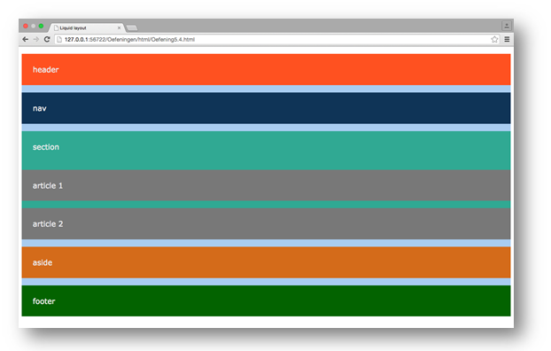
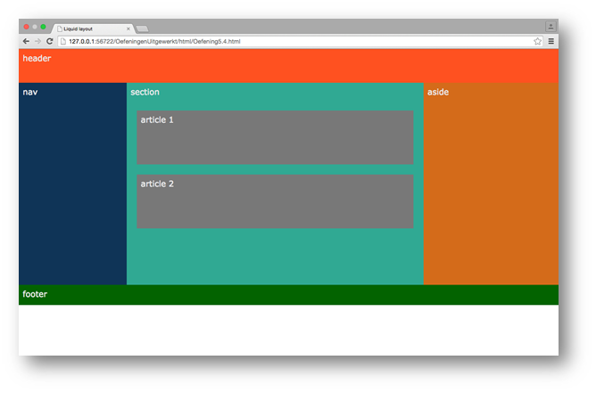
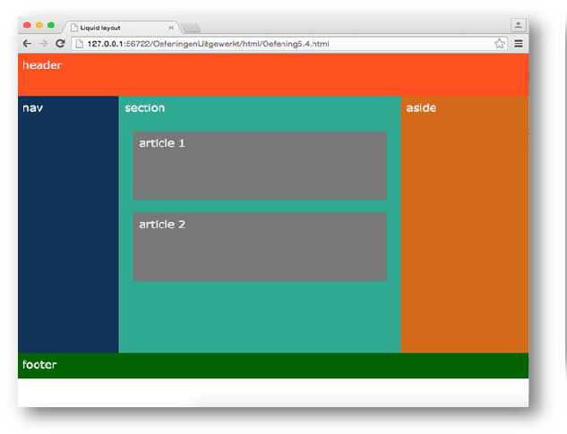

# Oefeningen hoofdstuk 5: Layout - Float - Position

Download of clone deze repository. Hiervoor klik je op de groene knop.

Pak deze zip uit in de map waar je alle leermateriaal van Webapplicaties I plaatst.

Ga nu naar Visual Studio Code en open deze map.

## OEFENING 1: Enkele korte oefeningen

### Opgave 1 
- Open het bestaande HTML en CSS bestand: float.html en float.css

- Bekijk de gegeven code. Op dit moment ziet de site er als volgt uit:

- Pas de CSS aan zodat we volgende layout bekomen ( bij maximaal scherm)

- Als we het scherm versmallen krijgen we het volgende:

- Tips
  - Zorg ervoor dat alle elementen een margin=0 hebben.
  - De eigenschappen width en height slaan op de content, border en padding samen (gebruik dus box-sizing).
  - De header heeft een hoogte van 8em.
  - De footer heeft een hoogte van 3em.
  - De drie elementen in het midden van de pagina hebben een breedte met de volgende procentuele verdeling 20/55/25,  hun hoogte is 30em.
  - De twee articles hebben een margin van 1.5em en een hoogte van 8em.
