# Oefeningen hoofdstuk 5: Layout - Float - Position

Download of clone deze repository. Hiervoor klik je op de groene knop.

Pak deze zip uit in de map waar je alle leermateriaal van Webapplicaties I plaatst.

Ga nu naar Visual Studio Code en open deze map.

## OEFENING 1: Enkele kleine oefeningen

### Opgave 1 
- Open het bestaande HTML en CSS bestand: float.html en float.css

- Bekijk de gegeven code. Op dit moment ziet de site er als volgt uit:
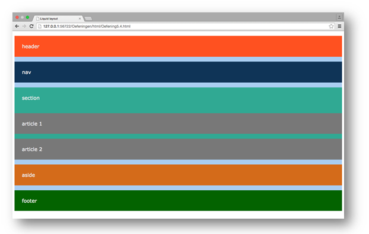

- Pas de CSS aan zodat we volgende layout bekomen ( bij maximaal scherm)
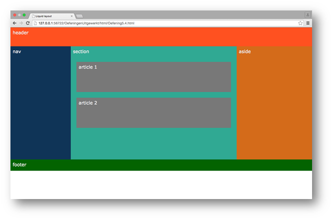

- Als we het scherm versmallen krijgen we het volgende:
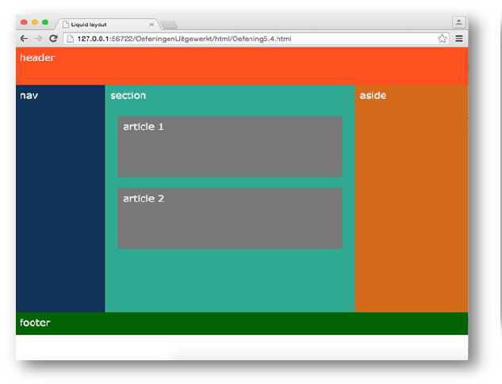

- Tips
  - Zorg ervoor dat alle elementen een margin=0 hebben.
  - De eigenschappen width en height slaan op de content, border en padding samen (gebruik dus box-sizing).
  - De header heeft een hoogte van 8em.
  - De footer heeft een hoogte van 3em.
  - De drie elementen in het midden van de pagina hebben een breedte met de volgende procentuele verdeling 20/55/25,  hun hoogte is 30em.
  - De twee articles hebben een margin van 1.5em en een hoogte van 8em.

### Opgave 2

- Open postion.html en position.css. We zien dit beeld:

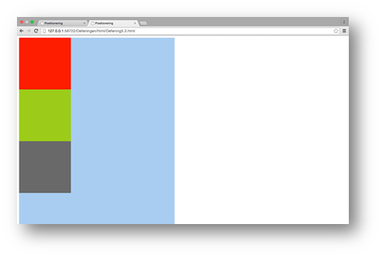

- Gebruik de juiste *position* en vul de CSS code aan zodat we volgend beeld krijgen bij gemaximaliseerd browservenster:

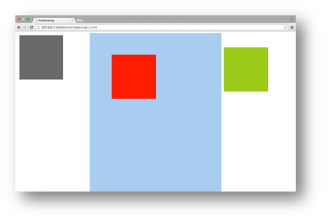

- Bij gemaximaliseerd browservenster, na scrollen naar beneden zien we:

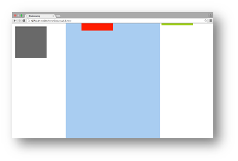

- het beeld bij een kleiner browservenster:

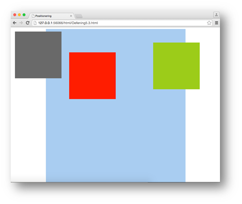

### Opgave 3

- Open de startbestanden (buildingblocks) en bekijk de aanwezige code. We hebben voorlopig:

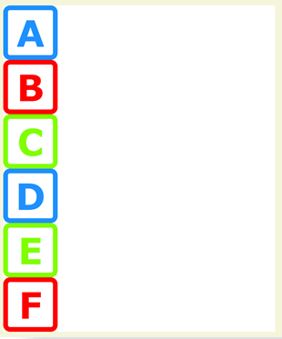

- Maak de piramide van blokken. Maak enkel gebruik enkel van float, margin, padding en clear. Het resultaat:

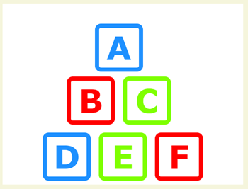

## Oefening 2: Garage Cnockaert

Maak deze oefening in de map Cnockaert (is reeds aangemaakt). Deze map bevat reeds HTML bestanden een CSS bestand en de afbeeldingen die in de oefening worden gebruikt.
Exacte waarden voor kleuren, padding en margin zijn in deze oefening van minder belang.
De essentie is dat de structuur correct is.

Het resultaat in de browser:

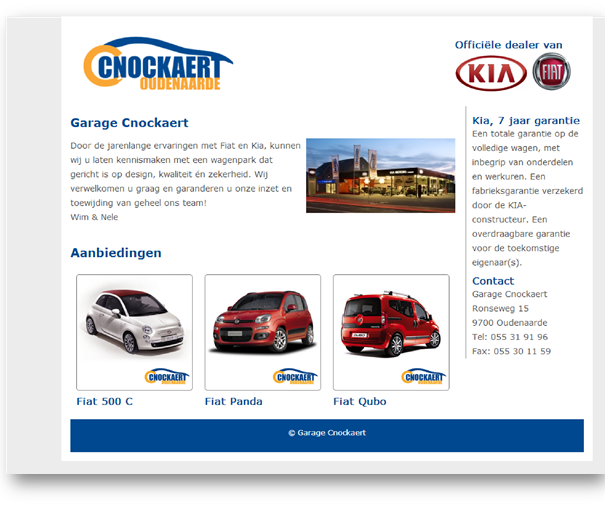

1. Maak uitsluitend gebruik van float–layout om de website  te maken.	
2. Garage Cnockaert + Aanbiedingen  h1.
3. Officiële dealer van Kia/ 7 jaar garantie / Contact / Fiat 500 C / Fiat Panda / Fiat Qubo	h3
4. Het centrale gedeelte heeft een breedte van 890px en is gecentreerd.	
5. De breedte van het linkse gedeelte is 75% van de totale breedte.	
6. De maximum breedte van elk van de 3 afbeeldingen van de auto’s is 195px

## OEFENING 3: YOKO
*aan te passen adhv de oplossing tot nu...*

Voeg de correcte CSS toe om volgende pagina te bekomen.

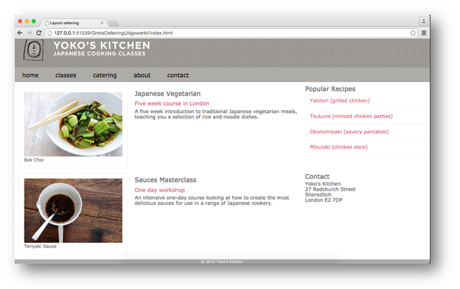

Dit is een mogelijk stappenplan om deze webpagina op te maken en te layouten.

1. Boxsize instellen

  - zorg ervoor dat width en heigth gelden voor content - padding - border bij de gepaste elementen (zie index.html)

2. Algemene instellingen voor webpagina

  - kleur - lettertype (sans-serif lettertype) - lijn hoogte (1.2) - een kleiner lettertype 

3. Opmaak header: kleur - bg-image - hoogte afbeelding header

4. Menubalk 

5. Opmaak afbeeldingen en beschrijving:

  - dimensies komen overeen met dimensies van *.jpg
  - kadertje eromheen met ruimte tussen kader en afbeelding
  - beschrijving komt rechts van de afbeelding te staan
  - extra ruimte tussen afbeelding en beschrijving
  - figcaption kleiner lettertype
  - extra ruimte tussen description en rechtse content

6. Overige opmaak

  - opmaak anchors in aside
  - meer afstand tussen recipes en contact
  - opmaak headings
  - opmaak nav en footer

7. Layout

  - Maak de gepaste blokken los uit de normale flow 
  - Courses (image en beschrijving) 70% en Recipes en contact 30%
  - Let op voor container collapse.
